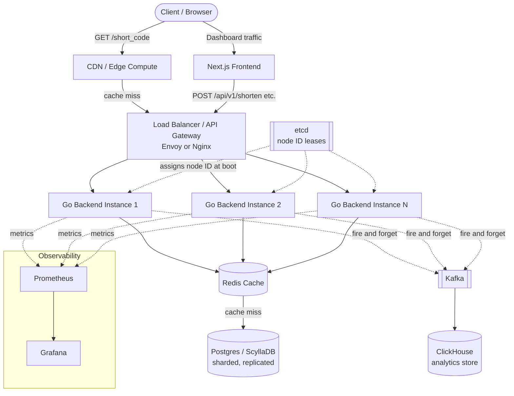

# Architecture

## Overview

A production-grade, horizontally scalable URL shortener built in phases,
optimized around one core fact: reads (redirects) vastly outnumber writes
(shortens) — realistically 100:1 to 1000:1. Every architectural decision
below optimizes the read path first.

## Non-functional targets

| Metric | Target |
|---|---|
| Read throughput | 50k redirects/sec |
| Write throughput | 500 shortens/sec |
| Redirect latency (p99) | < 50ms, ideally < 10ms |
| Availability | 99.9%+ |
| Cache hit ratio | 95%+ |

## System diagram

## Request paths

**Redirect path** — `GET /{short_code}`, the hot path:
Client → Edge (Phase 6) → Load Balancer (Phase 3) → Go backend →
Redis cache-aside → Postgres/ScyllaDB only on cold miss → 302 redirect.

**API path** — `/api/v1/*`, used by the dashboard:
Client → Frontend → Load Balancer → Go backend → Postgres (write or read),
async click-event fan-out to Kafka → ClickHouse.

## Component responsibilities

- **Edge / CDN (Phase 6)** — serves cached redirects from the closest
  location to the user, deflecting load from origin entirely for hot links.
- **Load Balancer / Gateway (Phase 3)** — distributes traffic across
  stateless app instances; owns rate limiting and, from Phase 7, circuit
  breaking to degrade gracefully on downstream failure.
- **Go backend (stateless)** — owns Snowflake ID generation, Base62
  encoding, request handling. Any instance can serve any request; no
  session affinity required.
- **Redis cache (Phase 2)** — cache-aside for `short_code -> long_url`;
  target 95%+ hit ratio so the vast majority of reads never touch the DB.
- **Postgres / ScyllaDB** — source of truth. Starts as single-node Postgres
  (Phase 1), moves to sharded Postgres or ScyllaDB (Phase 4) based on
  load-test data, sharded by `short_code` via consistent hashing.
- **Kafka + ClickHouse (Phase 5)** — click analytics fully decoupled from
  the redirect response path; ingestion volume can spike without ever
  affecting redirect latency.
- **etcd (Phase 3)** — leases a unique node ID to each app instance at
  boot, so Snowflake ID generation stays coordination-free per-request
  while still guaranteeing no collisions across instances.
- **Prometheus + Grafana** — p50/p95/p99 latency tracked separately for
  redirect vs write paths, plus cache hit ratio as a first-class metric.

## Why this architecture

- **Read path is decoupled from write path at every layer** — caching,
  edge distribution, and even analytics ingestion all exist so that the
  50k/sec redirect load never contends with the 500/sec write load.
- **No coordination on the per-request hot path** — ID generation
  (Snowflake), cache lookups, and redirects all resolve without a
  synchronous call to a coordination service; etcd is only consulted once,
  at instance boot.
- **Every component is horizontally scalable independently** — app
  instances, cache nodes, and DB shards can each scale out without
  redesigning the others, because they're connected through interfaces
  (`storage.URLStore`, `cache.Store`) rather than concrete dependencies.
- **Analytics can't degrade the core product** — Kafka's fire-and-forget
  fan-out means a slow or backed-up analytics pipeline never adds latency
  to a redirect; worst case, click data lags, but links keep working.
- **Storage engine choice is deferred, not guessed** — the interface-based
  storage layer means Postgres vs ScyllaDB is decided from real load-test
  numbers in Phase 4, not speculation in Phase 1.
- **Graceful degradation is architected in, not bolted on** — circuit
  breakers between app and cache/DB mean a cache outage falls back to the
  DB instead of cascading into a full outage.